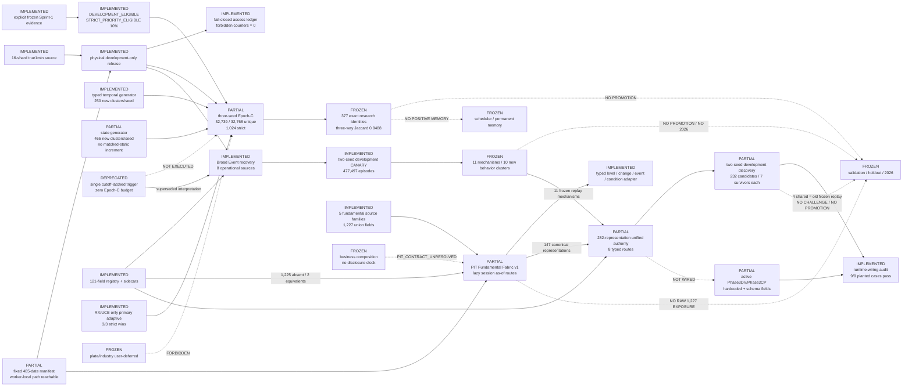

# Current Architecture

Updated: 2026-07-14

State: `CN_FEATURE_RUNTIME_WIRING_MISMATCH_CONFIRMED` on the physically
isolated 2024-2025 development-only release. The new unified capability path
works, but it is not yet the sole authority for legacy Phase3GA/CM/CN. Sealed
evaluation, formal search, promotion and cross-sprint memory remain frozen.

This projection is generated and checked from
`runtime/run_plans/evalreset_phase1_architecture_registry_v1.json` plus
`.planning/architecture/architecture_registry.json`. The registry is the sole
machine-readable status authority. `architecture_graph.json`, its HTML view and
this document are checked projections; SHA-bound raw source navigation is kept
separately under `.planning/codegraph/`.

## Current outcomes

- The strict-priority selector has both offline OOF lift and realized
  development strict lift. It is a frozen model, not online memory.
- Shared-backbone proxy and strict-priority rank correlations are 1.0 for all
  seed pairs; behaviour-cluster ARI is at least 0.9999857.
- RX/UCB beats its matched control at strict evaluation in all three seeds and
  remains the only primary adaptive challenger.
- Broad Event r5 passed all semantic, PIT, support, matched-control and access
  gates. Eleven mechanisms reproduced across two seeds in ten behavior clusters
  outside structural, static and temporal controls.
- Reproduced Event sources are billboard change, chip-structure change,
  hotness change and market-ecology transition. Limit lifecycle and vendor
  occurrence are operational but had no shared survivor in this CANARY.
- The all-proposal mean matched increment is negative; the result establishes
  localized reproducible mechanisms, not uniform Event superiority.
- The strict union has positive benchmark increment and is not dominated by a
  lane, primitive, family, parent or signal cluster.
- State does not beat matched static economically; novelty alone is not called
  alpha increment.
- The PIT Fundamental Fabric inventories 1,227 fields across 26,188 files. It
  provides conservative observable-time resolution, revision-aware snapshot
  handling, stock-session as-of joins, deterministic cache and lazy typed
  level/change/disclosure/condition routes without minute-panel expansion.
- Development-safe coverage is 274,761 balance-sheet, 269,643 profit, 259,237
  cash-flow and 2,615,891 holder rows. Holder rows form 262,629 disclosure
  episodes. All 1,227 raw fields remain unexposed to generators.
- The unified registry contains 282 candidate-visible representations: the
  121-field Fabric, 147 canonical fundamentals, 11 frozen Broad Event entries
  and 3 derived intraday states. All eight routes received proposal and strict
  development evidence across two seeds.
- The unified run produced 232 candidate rows and 7 survivors per seed. Its
  four shared exact survivors are all old frozen Broad Event replays. There is
  no new exact cross-seed fundamental mechanism; the one capital-investment
  alignment is family/template-level only.
- Nine planted wiring cases pass positive, matched-control, future-revision
  and metadata-misuse checks without performance evaluation.

## Active blockers and boundaries

- Epoch-C is partial because 29 RX identities repeated across seed expansions.
  The future guard is implemented and tested, but the historical run remains
  32,739 / 32,768 globally unique.
- The 377-identity union is research-only. It is not a forward-authorization
  pack and cannot enter promotion or positive memory.
- Epoch-D remains unrun. The Broad Event discovery entry pack is frozen for the
  unified development replay and does not authorize formal search.
- The versioned source-lagged statement/holder Fabric is implemented but remains
  infrastructure-only. The current 121-field registry has two semantic
  equivalents and omits the other 1,225 source fields.
- `zygc_em` has 17 fields and 945,812 rows but no credible independent
  disclosure clock, so its values were not read. Historical superseded
  statement revision values are also absent from the current snapshot release.
- Validation, holdout, spent, sealed, plate/industry and 2026 remain outside
  the allowed development feedback graph.
- `app.py` still selects the legacy Phase3DV route, whose hardcoded field pools
  and Phase3CP schema filtering bypass UnifiedCapabilityRegistry and
  TypedRouteCompiler. Runtime authority must converge before any new search.
- Phase3CM still calls a worker-local split map, and the chunk-04 recovery
  workers omit the fixed manifest before final exact normalization. The global
  manifest is correct, but worker-boundary enforcement is partial.
- The old run's challenge-eligibility boolean is superseded. Frozen replay
  alone cannot qualify a challenge; no challenge is open.
