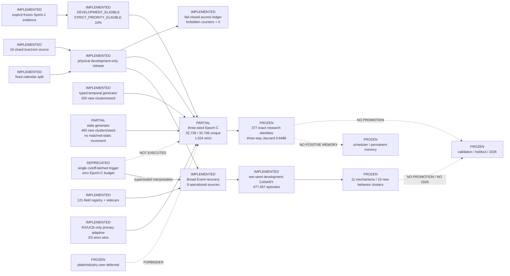

# Current Architecture

Updated: 2026-07-13

State: `CN_BROAD_EVENT_SYSTEM_RECOVERY_COMPLETED_DISCOVERY_ELIGIBLE` on the
physically isolated 2024-2025 development-only release. Sealed evaluation,
promotion and cross-sprint memory remain frozen.

This projection is generated and checked from
`runtime/run_plans/evalreset_phase1_architecture_registry_v1.json` plus
`.planning/architecture/architecture_registry.json`. The registry is the sole
machine-readable status authority. `architecture_graph.json`, its HTML view and
this document are checked projections; SHA-bound raw source navigation is kept
separately under `.planning/codegraph/`.

## Current outcomes

- The strict-priority selector has both offline OOF lift and realized
  development strict lift. It is a frozen model, not online memory.
- Shared-backbone proxy and strict-priority rank correlations are 1.0 for all
  seed pairs; behaviour-cluster ARI is at least 0.9999857.
- RX/UCB beats its matched control at strict evaluation in all three seeds and
  remains the only primary adaptive challenger.
- Broad Event r5 passed all semantic, PIT, support, matched-control and access
  gates. Eleven mechanisms reproduced across two seeds in ten behavior clusters
  outside structural, static and temporal controls.
- Reproduced Event sources are billboard change, chip-structure change,
  hotness change and market-ecology transition. Limit lifecycle and vendor
  occurrence are operational but had no shared survivor in this CANARY.
- The all-proposal mean matched increment is negative; the result establishes
  localized reproducible mechanisms, not uniform Event superiority.
- The strict union has positive benchmark increment and is not dominated by a
  lane, primitive, family, parent or signal cluster.
- State does not beat matched static economically; novelty alone is not called
  alpha increment.

## Active blockers and boundaries

- Epoch-C is partial because 29 RX identities repeated across seed expansions.
  The future guard is implemented and tested, but the historical run remains
  32,739 / 32,768 globally unique.
- The 377-identity union is research-only. It is not a forward-authorization
  pack and cannot enter promotion or positive memory.
- Epoch-D remains unrun. The Broad Event discovery entry pack is frozen for the
  next candidate-discovery contract and does not authorize formal search.
- Full PIT financial-statement assets exist locally, but only valuation,
  market-cap and holder subsets are in the current 121-field materialization.
  Statement fundamentals remain outside search until a versioned source-lagged
  Fabric expansion is completed.
- Validation, holdout, spent, sealed, plate/industry and 2026 remain outside
  the allowed development feedback graph.
