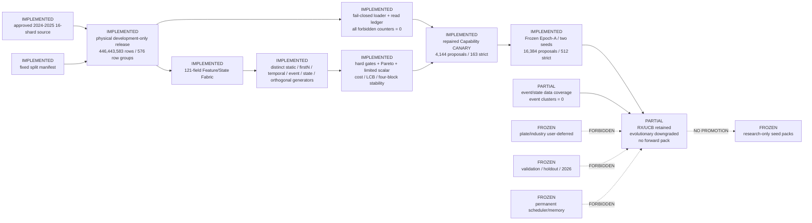

# Current Architecture

Updated: 2026-07-13

State: `CN_GENERATOR_RESEARCH_SPRINT1_PARTIALLY_COMPLETED` on a physically
isolated development-only release. Sealed evaluation, promotion and
cross-sprint memory remain frozen.

This projection is derived from the accepted Phase A registry plus
`runtime/run_plans/nextgen_dark_architecture_registry_v1.json`. The raw graph
contract is generated by `scripts/build_nextgen_dark_architecture_graph.py`;
node status is backed by implementation, artifact and test paths.

## Active components and evidence

- Development release: 16 shards, physical role isolation, fail-closed row
  group and cache provenance checks.
- Mechanism generators: distinct root distributions and typed programs for six
  mechanism lanes; event/state remain bounded by sparse materialized history.
- Adaptive challengers: RX/UCB learns hypothesis-arm and primitive-family
  development information gain. Evolutionary lineage is implemented but
  downgraded after strict matched-control failure.
- Objective: hard gates precede Pareto admission; cost-adjusted quality,
  turnover, worst block, stability, concentration, benchmark increment,
  complexity and behaviour novelty are explicit dimensions.
- Epoch-A: two frozen seed sets, separate caches and output namespaces, exactly
  8,192 proposals and 256 strict evaluations per seed.

## Active boundaries

- Development feedback is diagnostic only after Sprint closure. No result may
  update permanent memory, scheduler policy or candidate promotion state.
- Both Epoch-A read ledgers have zero forbidden file, row-group, validation,
  holdout and forward reads.
- Plate/industry fields and benchmarks remain disabled without historical PIT
  membership.
- All three authorized Sprint-1 experiment rounds are consumed. Epoch-B is not
  authorized to start automatically.
- The two 256-candidate packs are evidence artifacts, not a forward pack.
