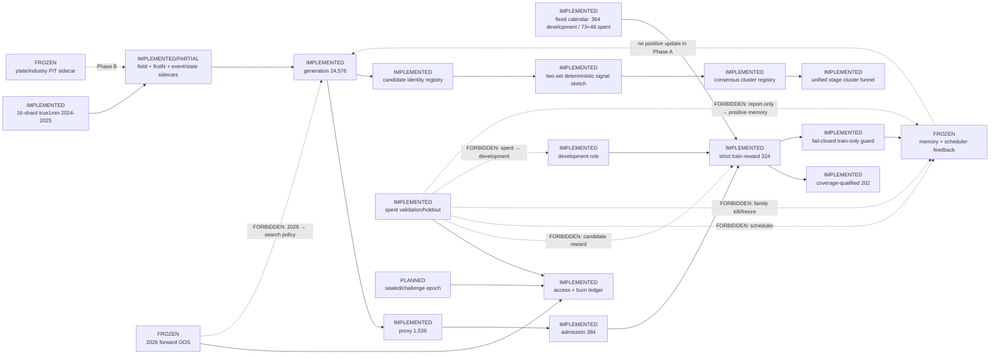

# Current Architecture

Updated: 2026-07-11

State: `A_EVALRESET / COMMITTED_AWAITING_USER_ACCEPTANCE`; Phase B is `FROZEN`.

The machine-readable node contract is generated from
`runtime/run_plans/evalreset_phase1_architecture_registry_v1.json` into
`graph.json`. Every node there contains status, implementation path,
input/output artifact, data role, feedback permission, test/evidence,
last-verified SHA, and blocker.

## Active boundaries

- Only fixed-calendar `development/train` coordinates may enter the signal
  sketch, reward, feedback, or scheduler inputs.
- Validation and holdout are spent. Their candidate-level results are forensic
  and report-only; they cannot kill, freeze, rank, schedule, or update memory.
- 2026 is separate forward OOS and remains sealed. No performance path is
  connected to search policy.
- Historical Phase3FIX is `PROVENANCE_UNVERIFIED`,
  `NON_REPRODUCIBLE_AS_EXECUTED`, and `NOT_VALID_FOR_PROOF`.
- Generation AST redundancy is observed. The stable signal-sketch audit found
  no significant signal-level collapse in generation through
  coverage-qualified transitions; this does not erase the separate structural
  redundancy finding.
- Signal sketches are diagnostic-only. They cannot create positive feedback or
  admit Phase B fields/events into the reward loop.
