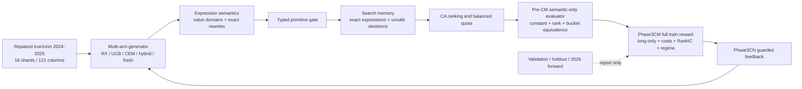

# Current Architecture

Updated: 2026-07-10

This is the curated active CNline2 architecture. It intentionally excludes
historical diagnostic branches that still appear in the raw knowledge graph.

## Active Contracts

- Data is true `trade_time` 1min; old 1D roots are forbidden.
- Search/training uses repaired 2024-2025 data. 2026 is separate forward/OOS.
- Construction safety is independent of memory; clearing memory cannot disable the semantic or typed gates.
- Sampled signal equivalence removes duplicate work for the current run but does not create unsafe skeleton blocks.
- Phase3CM optimizer reward is train-only and long-only for CN tradability.
- Validation and holdout are report-only.
- Operator cache default cap is 2 GiB per process; feature-matrix cache default cap is 4 GiB per process.
- Persistent disk cache remains size, free-space, and TTL bounded.

## Current Caveats

- The repaired root has no accepted full PIT plate-membership lane.
- Sampled vector equivalence is not final OOS evidence.
- SafeDiv tails are diagnosed; automatic clipping is not part of the current contract.
