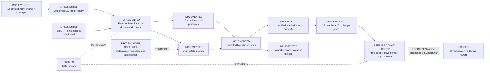

# Current Architecture

Updated: 2026-07-12

State: `NEXTGEN_DARK_INFRASTRUCTURE_READY` with plate/industry explicitly
excluded and frozen.

The current graph is generated by merging the accepted Phase A registry with
`runtime/run_plans/nextgen_dark_architecture_registry_v1.json`. Every node
contains implementation path, input/output artifact, data role, feedback
permission, test evidence, verification SHA, and blocker.

## Implemented boundaries

- Field roles are `primary`, `interaction-only`, `condition-only`, `state-only`,
  `benchmark-only`, and `blocked`; metadata and labels fail closed.
- Materialization keys, cache hashes, observable clocks, maturity, missing
  policies, lineage, and shard/batch-order invariance are explicit.
- Temporal and event post-window values are delayed until maturity.
- Every lane owns roots, quotas, archives, lineage namespace, seed, and
  candidate contract.
- Admission enforces exact-identity voting, stratification, descendant caps,
  fresh floors, no-memory/exile controls, and a global top-K baseline.
- Benchmark and competitor objects are frozen plans; no performance comparison
  was executed.
- The daily chip sidecar is previous-session mature, masks invalid price
  sentinels, and exposes only interaction/condition/benchmark roles.
- Plate/industry code and diagnostic artifacts are retained, but the complete
  capability is user-deferred and all feedback edges are frozen.
- Formal search, adaptive reward, and 2026 forward access remain frozen.
