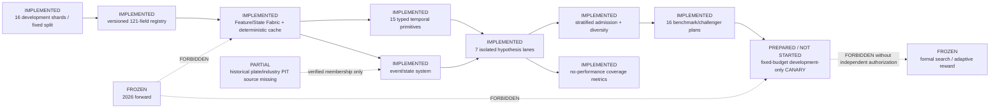

# Current Architecture

Updated: 2026-07-11

State: `NEXTGEN_DARK_INFRASTRUCTURE_PARTIALLY_READY`.

The current graph is generated by merging the accepted Phase A registry with
`runtime/run_plans/nextgen_dark_architecture_registry_v1.json`. Every node
contains implementation path, input/output artifact, data role, feedback
permission, test evidence, verification SHA, and blocker.

## Implemented boundaries

- Field roles are `primary`, `interaction-only`, `condition-only`, `state-only`,
  `benchmark-only`, and `blocked`; metadata/labels fail closed.
- Materialization keys, cache hashes, observable clocks, maturity, missing
  policies, lineage, and shard/batch-order invariance are explicit.
- Temporal/EventWindow post-event values are delayed until maturity rather than
  exposed at event time.
- Every lane owns its root distribution, proposal/admission quotas, archive,
  lineage namespace, seed, and candidate contract.
- Admission enforces exact-identity voting, family/bucket stratification,
  descendant caps, fresh floor, no-memory/exile controls, and a deterministic
  global top-K baseline.
- Benchmark and competitor objects are frozen plans only; no performance
  comparison was executed.
- The historical PIT group implementation rejects group `0`, placeholders,
  future-observed membership, overlaps for single-valued industries, and
  survivorship-unsafe joins. The missing historical source keeps this node
  `PARTIAL`.
- Formal search, adaptive reward, and 2026 forward access remain frozen.
