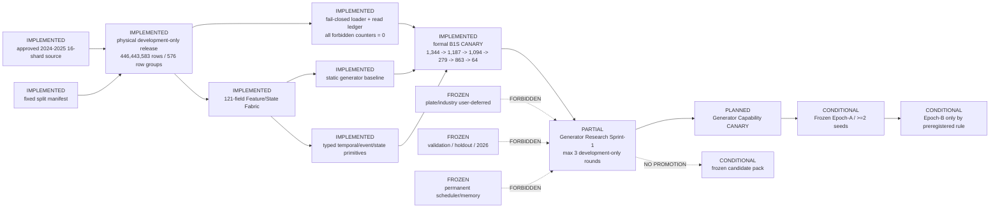

# Current Architecture

Updated: 2026-07-12

State: `CN_GENERATOR_RESEARCH_SPRINT1_ACTIVE` on a physically isolated
development-only release. Sealed evaluation, promotion and cross-sprint memory
remain frozen.

The current architecture contract is generated from the accepted Phase A
registry plus `runtime/run_plans/nextgen_dark_architecture_registry_v1.json`.
Every graph node carries implementation paths, input/output artifacts, data
role, feedback permission, test evidence, verification scope/SHA and blocker.

## Active boundaries

- Loader validates release identity, physical file set, row-group role/date
  metadata, hashes and cache provenance before candidate generation.
- Sprint feedback is development-only and ephemeral. No candidate, reward or
  adaptive statistic may persist across the sprint boundary.
- Generator Capability CANARY and Epoch contracts must freeze all search and
  evaluation knobs before data reads.
- Novelty cannot compensate negative economic or benchmark increment.
- Plate/industry fields, validation, holdout and 2026 remain unavailable.
- The previous 64-candidate pack is diagnostic input only and is not promoted.
