# EVALRESET Feedback Loop Map

Date: 2026-07-11

This map separates observed historical flows from the new machine-enforced
boundary. A dashed red edge is a prohibited route, not an active dependency.

```mermaid
flowchart LR
    P["Legacy proxy and IC decisions"] --> PR["_prior_reward"]
    PR --> SEED["In-arm UCB and CEM seed policy"]
    ARM0["Predecessor CN arm table"] --> SCH0["Predecessor CO scheduler"]
    SCH0 --> GEN["Generation: 24,576 rows"]
    SEED --> GEN

    GEN --> CAN["Canonical expression and typed gate"]
    CAN --> DEDUP["Expression and unsafe-skeleton memory"]
    DEDUP --> PROXY["CA proxy quota: 1,536 rows"]
    PROXY --> FIELD["Field and turnover admission"]
    FIELD --> PRE["Pre-CM signal gate"]
    PRE -->|"historical Phase3FIX: disabled"| CM["CM admission: 384 rows"]
    CM --> REWARD["Fixed-calendar strict reward: 324 semantic-valid rows"]
    REWARD --> QUAL["Development coverage-qualified: 202 rows"]

    GEN --> SKETCH["Two-set development signal sketch"]
    SKETCH --> CLUSTER["Candidate identity + consensus cluster registry"]
    CLUSTER --> MAP["Same cluster IDs mapped through 24,576 → 1,536 → 384 → 324 → 202"]
    MAP -. "diagnostic only; no feedback" .-> REPORT

    DEV["Development / train: 364 dates"] --> REWARD
    REWARD --> TRAINONLY["Train-only feedback projection"]
    TRAINONLY --> CN["CN memory without OOS columns"]
    CN --> SCH["Guarded scheduler (frozen in Phase A)"]
    SCH -. "positive update forbidden in Phase A" .-> GEN

    SPENT["Spent validation + holdout: 121 dates"] --> REPORT["Historical reports"]
    REPORT --> HUMAN["Human review and canary choice"]
    HUMAN --> FUTURE["Future candidate distribution"]

    SPENT -. "FORBIDDEN: candidate reward" .-> REWARD
    SPENT -. "FORBIDDEN: scheduler" .-> SCH
    SPENT -. "FORBIDDEN: family kill/freeze" .-> SCH
    SPENT -. "FORBIDDEN: spent → development" .-> DEV
    REPORT -. "FORBIDDEN: report-only → positive memory" .-> CN
    FWD["2026 forward: performance unexposed"] -. "forbidden during EVALRESET" .-> REWARD
    FWD -. "FORBIDDEN: forward → search policy" .-> GEN

    classDef forbidden stroke:#c62828,color:#c62828,stroke-width:2px;
    class SPENT,FWD forbidden;
```

## Observed Feedback Findings

- The Phase3FIX run inherited a predecessor arm-budget table and legacy
  proxy/IC seed policy before generation.
- Exact expression/search-memory keys affect novelty and dedup, while unsafe
  skeleton memory permanently blocks known structural hazards.
- The run's pre-CM signal-equivalence gate was disabled. The 60 semantic blocks
  were applied during exact recovery, after the historical admission decision.
- Train reward was the automatic optimizer split, but the predecessor Phase3CN
  memory physically carried validation and holdout metrics.
- Human inspection of validation/holdout and canary selection created a real
  path from spent results to future candidate distribution even without a code
  edge into arm score.

## Enforced Boundary

`evalreset_feedback_guard_v1` permits only development/train payloads. Raw CM
split/source/metric provenance is checked before schema normalization; any
existing non-development role cannot be relabeled. Candidate-level
non-development fields are removed only at the explicit projection boundary
and raise at every downstream search-feedback or scheduler input.
